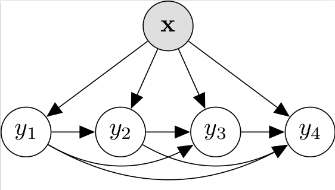

== Research

=== Multi-label Classification

//talks/Multilabel-Part01.pdf
Multi-label classification is relevant to many domains, for example text
categorisation (a document belongs to multiple categories), scene
classification (each image may have be associated with multiple concepts or objects)
as well as video and other media, medical diagnosis, and applications in
microbiology. 

The main challenge is detecting and modelling dependencies
between labels, without this model becoming too computationally complex. 

Multi-label classification is
closely related to __ranking__, __multi-target prediction__, and
__structured output prediction__.  It also has close connections with other topics (which are also research interestes), including

* _probabilistic graphical models_
* _neural networks_
* _time series forecasting_
* models for _sequence learning_ 
* _structured-output prediction_.

===	Data Stream Classification

Many real-world applications are found in the context of __data
streams__, where data instances arrive continuously in a
theoretically-infinite stream, for example in sensor networks, online
social media, news feeds, and large deployments of e-mail. 

In this context, methods must be able to process large volumes of data quickly
and learn and make predictions in real time, as well as detect and adapt
to __concept drift__.

=== Applications

Some applications dealing with sensory-data that I have worked on with real-world sensor deployments.

==== Learning to predict a traveller's route and destination

In Aalto University I was involved in the link:http://energyefficiency.aalto.fi/en/research/trafficsense/[Traffic Sense - Energy Efficient Traffic with Crowdsensing] project doing route recognition and prediction. Given only a week or so of location data from a mobile phone device, it was possible to make reasonably accurate predictions about the traveller's route and future destination. See the

//image::figures/dev98.png["TrafficSense", height=150, width=150, align="center", link="https://drive.google.com/file/d/0B-MBtJlIZA-BWkVVYkJETEtZckk/view?pref=2&pli=1"]

* link:https://drive.google.com/open?id=0B-MBtJlIZA-BWkVVYkJETEtZckk[Demo Animation] (the captions explain what is going on)

==== Tracking on very low-power sensor motes

In the link:http://www.comonsens.org/[Comonsens] project in Spain I worked on formulating and implementing a distributed particle filter on very low-power motes for target tracking.  For more information, see the

//image:figures/:DPF-matlab.png["CommonSense", height=200, width=150, align="center", link="DPF-matlab.png"]

* link:./talks/COMONSENS3[Slides from a project talk]
* link:https://drive.google.com/file/d/0B-MBtJlIZA-BcU1sZXpaNlV3a3M/view?usp=sharing[A Video of testbed deployment]

==== Modelling tree growth in Scots pine

In the project http://www.hiit.fi/pm/multitree/[MultiTree - Multi-scale modelling of tree growth, forest ecosystems, and their environmental control], I am working with forestry scientists to model intra-annual growth of pine trees using machine learning methods.

