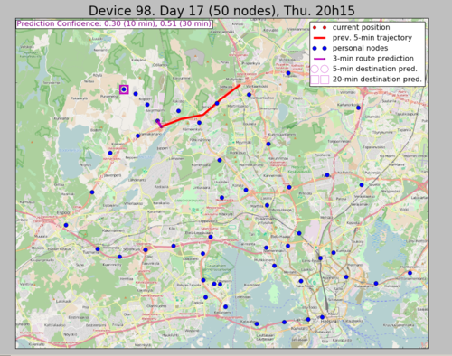
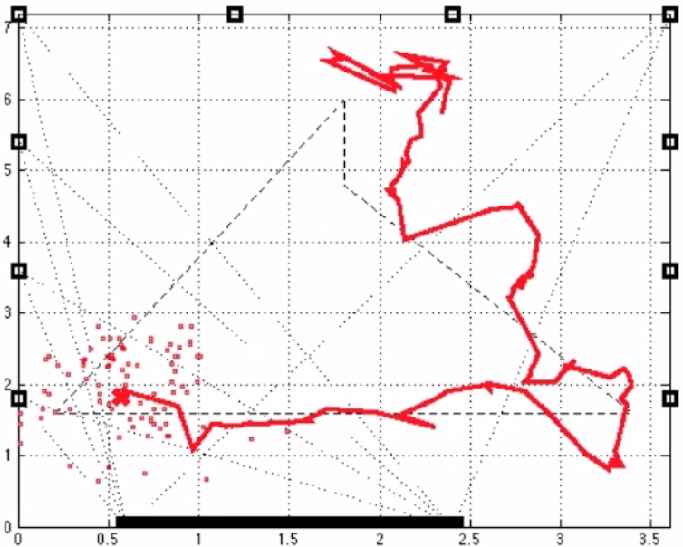

== Research Interests

My research interests are in the areas of *machine learning* and *data science and mining*, and *artificial intelligence*:

* *Multi-label classification* and *multi-output/structured prediction* 
// in general; including weakly supervised and missing label settings
* *Neural networks* and *deep learning*
* *Monte Carlo methods* and *particle filters*
* *Wireless sensor networks* and *sensory data*
* Learning from *evolving data streams*: *Time series* modeling and forecasting, *transfer learning*, *continual learning* and detection of and adaptation to *concept drift*
* *Anomaly detection* and *explainability*
* *Reinforcement learning*

== A Selection of Topics 

=== Multi-label Classification

In *multi-label classification*, _multiple_ target variables are associated with each instance, as opposed to the traditional supervised learning problem where a single target variable (i.e., class) where only a single value is assigned to each instance. The main challenge is detecting and modelling dependencies among labels, while maintaining scalability to large problems. 

This task is relevant to many domains where multiple labels can be assigned to text documents, images, video and other media, and are also involved in many medical and biological applications. 

//In recent years, multi-label methods have become increasingly scalable. This has led to a broader possibility of applications. Actually multi-label prediction is a particular type of *structured output prediction* and can be applied to topics such as sequence prediction and forecasting, localization and segmentation, and many image and text-based tasks. There exist strong connections with other topics, namely *probabilistic graphical models*, *neural networks* (including *deep learning*), *time series forecasting*, sequence *segmentation* and mining, and dynamical models; all of which are among my research interests.

We developed classifier chains, 

 
// | image::figures/ml.png[ML, align="center"]

where, in its simplest configuration, the predictions of one model (used to predict values for one of the labels) are used as additional feature inputs for the next model in the chain. Many variations/extensions have been produced. Open questions: 

* How does this setting apply to the case of continuous outputs (regression chains)
* What metrics should we be using?
* What are the existing connections to deep learning methodology?

// ==== Multi-output Regression

// ==== [2017] Hidden nodes

// ==== [2018] Blended metric

// There are over a dozen regularly used evaluation metrics in multi-label classification. Which one to use? We found that 
// (Paper accepted in ECML-PKDD 2018). 

// ==== [2015] MCC

==== Data Stream Classification

Many real-world applications are found in the context of *data streams*, where data instances arrive rapidly and continuously in a theoretically-infinite stream, for example in sensor networks, online social media and text streams, anomaly and event detection.  

Many assumptions made in the literature about data streams don't actually need to be met in practice (such as instance-incremental learning; often batch-incremental approximations are good enough). Other assumptions are more difficult to meet, for example, a stream of labels. Often few or now labels are available. A typical scenario is that of *anomaly detection*. Or available in the form of a reward signal (reinforcement learning). If a stream of labels is available, the label often represents the future (now the present); this indicates strong temporal dependence and we may consider this a time series, but still with the important constraints of streams: methods must be able to learn and make predictions in real time (a full forward-backward pass is not possible), as well as detect and adapt to *concept drift*. 

We have started the link:test[Scikit-Multiflow] project for learning from data streams in Python. 

// [2018] Concept Drift in Data Streams is a Time Series

// ==== (Work in Progress) Scikit-Multiflow

==== Modelling and diagnosis of insomnia

We (with Olivier Pallanca) are building predictive models for diagnosing different types of insomnia (including types which can be treated with non-pharmaceutical options) and predicting a response to the different treatments. The idea is to formulate the most appropriate treatment for each patient (personalised medicine). We have psychological questionnaires, EEG and ECG signals, for around thousand patients. This involves a number of subtasks such as event detection in sequences and streams involving multiple correlated outputs.

// ==== (Work in Progress) Antoine paper

// === Reinforcement Learning

=== Application: Predicting an urban traveller's route and destination

Given only a week or so of location data from a mobile phone device, it was possible to make reasonably accurate predictions about the a traveller's route and future destination in an urban setting. Here is a link:https://drive.google.com/open?id=0B-MBtJlIZA-BWkVVYkJETEtZckk[Demo Animation] (the captions explain what is going on) 

-- using real data collecting in the greater Helsinki area.

=== Application: Modelling tree growth in Scots pine

We worked with forestry scientists from the University of Helsikni to model intra-annual growth of Scots pine trees at sites in Finland and France using time series and machine learning models link:http://www.sciencedirect.com/science/article/pii/S0168192316303677[(paper)].

// ==== [2014] ARM

// In Adaptive Rejection Sampling (ARS) we build piecewise fits to the log density. A Gibbs-type approach needs automatic and fast samplers to draw from univariate (full-conditional) densities, such as those ones. The Adaptive Rejection Metropolis Sampling (ARMS) technique is thus widely used within Gibbs sampling, but can suffer from an incomplete adaptation of the proposal. We propose an alternative Independent Adaptive MCMC algorithm (IA2RMS) that overcomes this limitation.

=== Kaggle Comptition: Meta labels for Large Scale Hierarchical Text Classification

We won the 2014 LSHTC4 Kaggle competition, in part using an approach based on *meta labels*. Papers (see publications): 
- Multi-label Classification with Meta Labels
- Kaggle LSHTC4 Winning Solution

=== Application: Tracking on very low-power sensor motes

We formulated and implementing a distributed *particle filter* on very low-power _motes_ (4 MHz CPU) for real-time target tracking. link:https://drive.google.com/file/d/0B-MBtJlIZA-BcU1sZXpaNlV3a3M/view?usp=sharing[This video of a demo of testbed deployment] shows tracking using only light sensor observations. 

//* link:./talks/COMONSENS3[Slides from a project talk]

